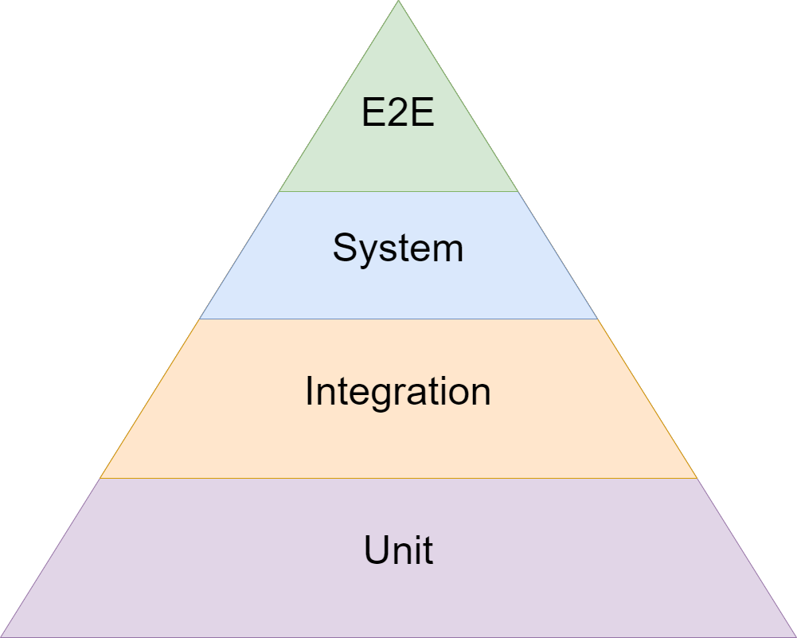

# Example of pytest playwright test automation project

## Automation Testing Mission

- Make automated tests useful to the whole software development team, not only a test team.
- Make test results clear and visible to the team.
- make tests small, fast and independent of each other to run in parallel.
- Make tests easy to read, maintain and update.
- Run tests regularly. Preferably on every software change. Introduce different test workflows to achieve different test
  goals.
- Keep in mind the pyramid of testing. Normally there should not be more E2E tests then integration tests and unit
  tests.
  

## Test Automation Possible goals

⚠️ If you not sure why do you need test automation, maybe you don't really need it. It is not a magic pill that will
solve all your problems.

- Provide quick feedback on software quality on every build and/or deployment
- Automate regression testing to save time and resources and avoide testing routine
- Automate API testing for flawless integration
- Create automated **quality gate** before UAT testing

## Test Automation limitations
Do not start automation testing if...
- You are doing a project with a lot of changes. You will spend more time updating tests than writing new features.
- You are doing a project with a lot of UI changes. UI tests are the most fragile and hard to maintain.
- You are doing a project with a lot of manual testing. Manual testing is still needed and should be done by a human. And it is usually cheaper ¯\_(ツ)_/¯
- You don't have experts to do or to validate automation testing.
- You don't have time to do automation testing. It is not a quick task. It is a long term investment.

## About the course

Materials to help you get started with test automation using pytest and playwright.  
Software to be tested is a https://coffee-cart.app/

## Installation

1. Install python 3.11 or higher
2. activate virtual environment
3. install poetry `pip install poetry`
4. run `poetry install` to install all dependencies
5. install Playwright browsers `playwright install`
6. to update dependecies if new versions are available or new dependencies are added run `poetry update`

## Run tests

- Check test configuration in [pyproject.toml](pyproject.toml) file
    - Make sure tests are running in headless mode
    - Make sure tests are running in parallel
- run `pytest` to run all tests in the project
- run `pytest -m mobile` to run mobile tests only
- run `pytest -m quality_gate` to run QG tests only

## Details

- There are examples of GitHub Actions workflows in [.github/workflows](.github/workflows) folder
- There is integration with [Testomat.io](https://testomat.io/) to sync the test case and to report test results
- Tests a prepared to run in parallel using pytest-xdsit
- Tests are utilizing page object pattern

## Plans
- Add a report in [CTRF](https://ctrf.io/) format to generate nice report in the GitHub