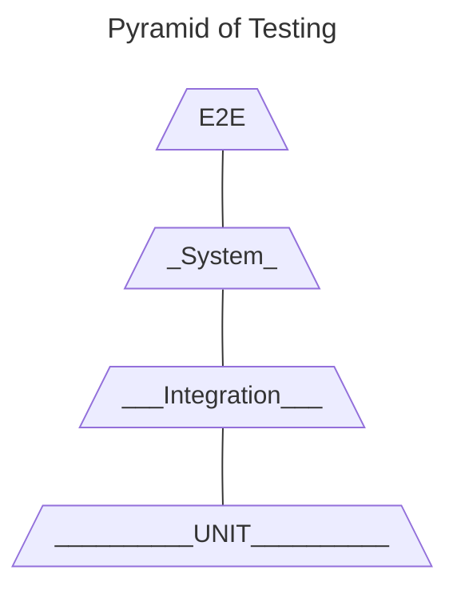

## Test Goal Options
- Cover regression testing. 100 test cases. 3 months.
- Automate API testing for BE CI/CD pipeline. 2 sprints.
- Create automated **quality gate** before UAT testing. 1 month.

## Test Mission
- Make automated test useful for the team.
- Make test results clear and visible to the team.
- make tests small, fast and independent of each other to run in parallel.

